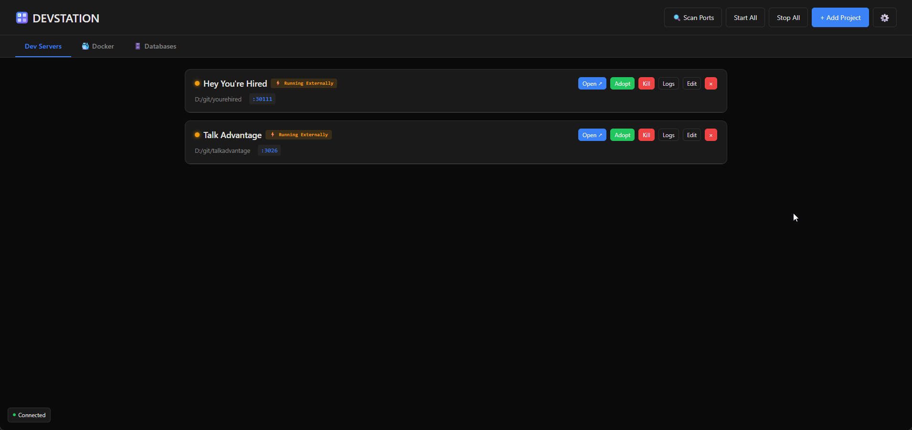
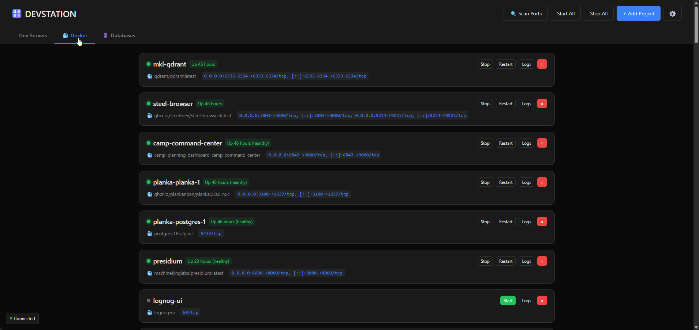
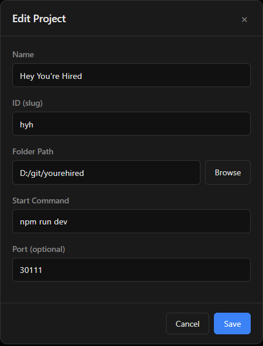

# DevStation

[](https://www.npmjs.com/package/devstation)
[](https://www.npmjs.com/package/devstation)
[](https://opensource.org/licenses/MIT)

A lightweight, cross-platform dashboard for managing multiple development servers, Docker containers, and databases from one place.


## Why DevStation?

Tired of juggling multiple terminal windows running `npm run dev` for different projects? DevStation gives you:

- **One dashboard** to see all your dev servers
- **One-click** start, stop, restart
- **Real-time logs** without switching terminals
- **Crash detection** with visual alerts
- **External process detection** - finds servers running outside the dashboard
- **Docker & database management** in the same UI

---

## Screenshots

### Dev Servers Tab
Manage all your development servers. See which are running, crashed, or running externally (started from terminal instead of dashboard).



### Docker Tab
View and control all your Docker containers - start, stop, restart, view logs, or remove them.



### Add/Edit Projects
Simple form to add new projects or edit existing ones.



---

## Features

- **Dev Server Management** - Start, stop, restart dev servers with one click
- **Real-time Logs** - View console output via WebSocket streaming
- **Docker Integration** - List, start, stop, restart, remove containers
- **Database Detection** - Auto-detect PostgreSQL, MongoDB, Redis, MySQL
- **External Process Detection** - Find dev servers running outside the dashboard
- **Crash Detection** - Visual indicators when servers crash
- **Port Scanning** - Scan all ports for running dev servers
- **Light/Dark Themes** - Toggle in settings
- **Mobile Responsive** - Works on phones and tablets
- **CLI Tool** - Full command-line interface with JSON output
- **Cross-Platform** - Windows, macOS, Linux

---

## Quick Start

### Windows

```batch
git clone https://github.com/MachineKingLabs/devstation.git
cd devstation
npm install
start.bat
```

Or double-click `start.bat`

### macOS / Linux

```bash
git clone https://github.com/MachineKingLabs/devstation.git
cd devstation
npm install
./start.sh
```

Then open **http://localhost:4000**

---

## Installation

### Option 1: Run with Node.js

```bash
npm install
node server.js
```

### Option 2: Global Commands (Linux/macOS)

```bash
chmod +x install.sh
./install.sh
```

Creates global commands:
- `devstation` - Start the dashboard
- `devd` - CLI tool

### Option 3: Standalone Executable

Build executables that don't require Node.js:

```bash
npm run build
```

Creates:
- `dist/devstation-win.exe` - Windows
- `dist/devstation-linux` - Linux
- `dist/devstation-macos` - macOS

---

## CLI Usage

```bash
# Status
devd status              # All projects
devd status myproject    # Single project

# Control
devd start <id>          # Start a project
devd stop <id>           # Stop a project
devd restart <id>        # Restart a project

# Utilities
devd logs <id>           # View recent logs
devd list                # List all project IDs
devd open <id>           # Open in browser
devd scan                # Scan for running servers

# Bulk operations
devd start-all
devd stop-all

# JSON output (for scripts/AI agents)
devd status --json
devd start myproject -j
```

---

## Adding Projects

### Via Web UI

1. Click **+ Add Project**
2. Fill in the form:
   - **Name** - Display name
   - **ID** - Unique slug (lowercase, hyphens)
   - **Folder Path** - Full path to project
   - **Start Command** - e.g., `npm run dev`
   - **Port** - Optional, enables "Open" button

### Via projects.json

```json
[
  {
    "id": "my-app",
    "name": "My Application",
    "folder": "D:/git/my-app",
    "command": "npm run dev",
    "port": 3000
  }
]
```

---

## Keyboard Shortcuts

| Key | Action |
|-----|--------|
| `Shift + S` | Start all |
| `Shift + X` | Stop all |
| `N` | Add project |
| `Esc` | Close modal |

---

## Settings

Click ⚙️ to configure:

- **Theme** - Dark / Light
- **Auto-refresh** - 5s, 10s, 30s, 1min, or disabled
- **Log lines** - 50, 100, 200, or 500
- **Auto-start** - Start all projects on launch

---

## API

```bash
GET  /api/status              # All projects
GET  /api/status/:id          # Single project
POST /api/start/:id           # Start
POST /api/stop/:id            # Stop
POST /api/restart/:id         # Restart
GET  /api/logs/:id?lines=50   # Logs
GET  /api/scan                # Port scan

# Docker
GET  /api/docker              # List containers
POST /api/docker/start/:id
POST /api/docker/stop/:id
POST /api/docker/restart/:id
POST /api/docker/remove/:id
GET  /api/docker/logs/:id

# Databases
GET  /api/databases           # Detect running DBs
```

---

## Environment Variables

| Variable | Default | Description |
|----------|---------|-------------|
| `DEVSTATION_PORT` | 4000 | Dashboard port |

```bash
# Change port
DEVSTATION_PORT=5000 node server.js
```

---

## Tech Stack

- **Backend** - Node.js, Express, WebSocket
- **Frontend** - Vanilla HTML/CSS/JS (no frameworks)
- **Process Management** - tree-kill
- **Bundling** - pkg

---

## License

MIT License

---

Built by **Machine King Labs**
